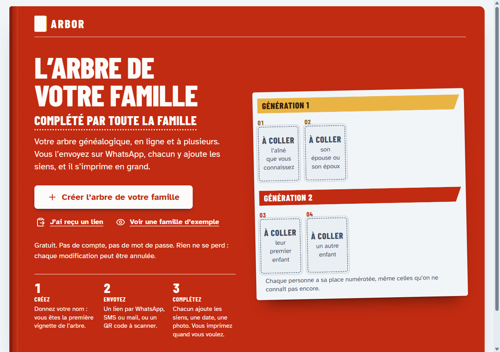
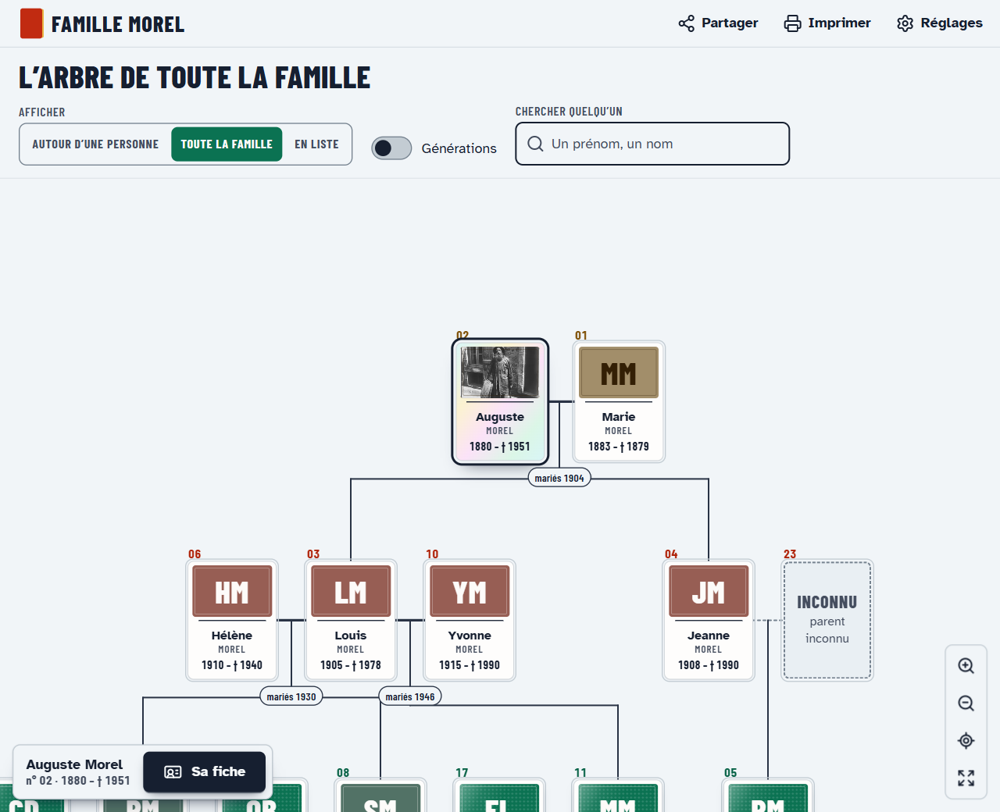
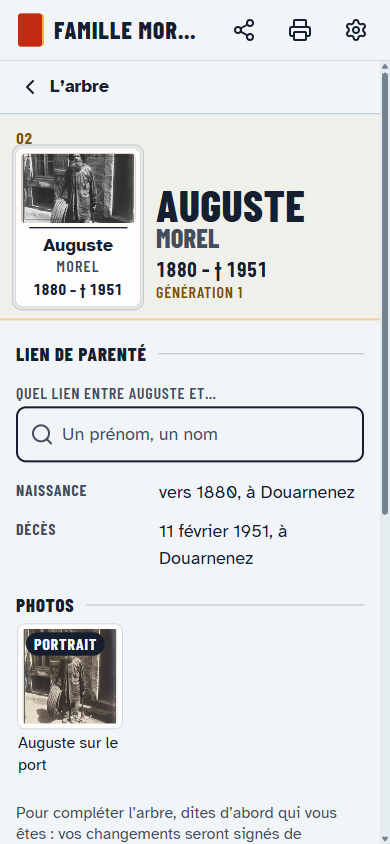

# Arbor

A family tree the whole family keeps up to date together. Someone creates the
family, shares the link, and every relative can add people, fix a date, attach
a photo or record a wedding — no account, no password, nothing to install.
The tree prints on paper for those who prefer it, with a QR code back to the
live version. Every edit is kept in the family's change log, so nothing is
ever lost and any past state can be restored.

**Try it:** [arbor.adrienlcp.com](https://arbor.adrienlcp.com) — the example
family is fictional, open to anyone, and starts over every night.







## Architecture

Zero running cost, on Cloudflare's free plan with no card on file:

- one Worker serves the web app (Vite + React) as static assets and answers the API;
- each family is its own Durable Object, with its own SQLite: people, unions, events, photos, change log;
- families are isolated by construction — a family link's key only ever reaches its own object;
- photos are resized in the browser before upload and stored as blobs in that SQLite;
- the limit to watch is 100,000 rows written per day, shared by every family.

Details, limits and the cheapest paid steps: [`docs/architecture.md`](docs/architecture.md).
Product and privacy: [`docs/product.md`](docs/product.md). Data model:
[`docs/data-model.md`](docs/data-model.md).

## Develop

Node 26 and pnpm 12 (through Corepack).

```sh
pnpm install
pnpm dev     # web on http://localhost:5520, worker on :8790
pnpm seed    # in another terminal: creates the example family locally, prints its links
```

The worker runs with its Durable Objects on real local SQLite files
(`apps/worker/.wrangler/`); there is no database to install.

```sh
pnpm validate          # lint, spell check, build, unit and end-to-end tests
pnpm lighthouse:quick  # accessibility, best practices and SEO audit
```

## Deploy

Every push to `main` that passes CI is deployed by `wrangler deploy` to
`arbor.adrienlcp.com`. The workflow needs two repository secrets,
`CLOUDFLARE_ACCOUNT_ID` and `CLOUDFLARE_API_TOKEN`.

## License

AGPL-3.0-or-later
